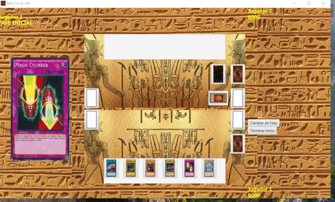

## Pre visualización

# Cartas Modeladas

## Monstruos Normales
La cantidad de monstruos normales modelados es arbitraria: dos de cada estrella. Es muy simple agregar tantos monstruos sin efectos como se quiera.

* Aitsu
* Amphibian Beast
* Ancient One of The Deep Forest
* Claw Reacher
* Cloudian - Smoke Ball
* Cyber-Tech Alligator
* D. D. Trainer
* Dark Assailant
* Gem-Knight Crystal
* Hinotama Soul
* Killer Needle
* Launcher Spider
* Rabidragon
* Sealmaster Meisei
* Tri-Horned Dragon
* Wings of Wicked Flame

## Monstruos Con Efectos
* Exodia The Forbidden One
* Right Arm Of the Forbidden One
* Left Arm Of The Forbidden One
* Right Leg Of The Forbidden One
* Left Leg Of The Forbidden One
* Blue-Eyes White Dragon
* Blue-Eyes Ultimate Dragon
* Man-Eater Bug
* Jinzo #7

## Mágicas
* Dark Hole
* Fissure
* Pot of Greed

## Trampa
* Magic Cylinder
* Reinforcements

## Campo
* Sogen
* Wasteland
